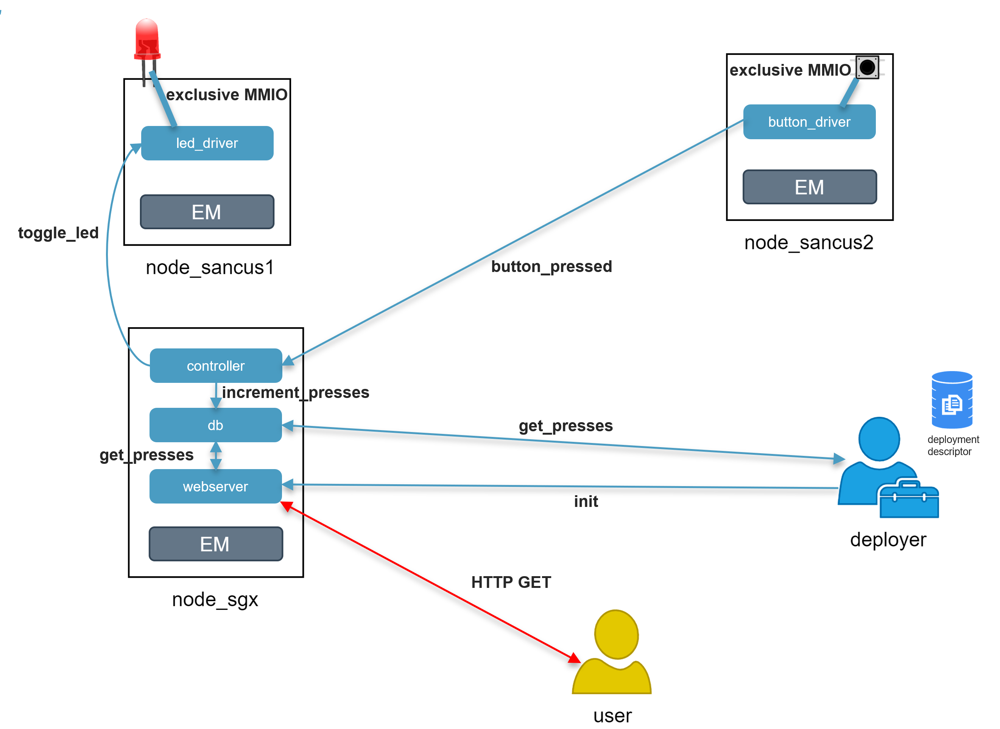

# Authentic Execution

This repository contains source code, documentation & links about the talk presented at FOSDEM 21: [An Open-Source Framework for Developing Heterogeneous Distributed Enclave Applications](https://fosdem.org/2021/schedule/event/tee_sancus/).

## What is this?

We are developing a framework to allow developers to easily build and deploy distributed, heterogeneous applications with strong **integrity** and **confidentiality** guarantees.

- Each component of the application (called _module_ or SM) runs in a **Trusted Execution Environment** (TEE) to enable _confidential computing_: code and sensitive data of the module are protected from any other software on the same machine.
- Communication channels between modules are **encrypted and authenticated** using symmetric keys: each single connection uses a different key, known only by the two modules of the connection and the deployer.
- Our framework is **heterogeneous**: currently, it supports [SGX](https://www.intel.com/content/www/us/en/architecture-and-technology/software-guard-extensions.html) and [Sancus](https://distrinet.cs.kuleuven.be/software/sancus/) TEEs. The former is the most popular TEE, included in all recent Intel processor. The latter is an open-source, embedded TEE designed for lightweight IoT systems. We are working to provide support for [ARM TrustZone](https://developer.arm.com/ip-products/security-ip/trustzone), which will be available soon.
- The applications developed with this framework provide **end-to-end** **security** from high-end computation nodes to small low-end systems that include I/O devices (e.g., sensors, buttons, LCD screens, LEDs, etc.). Thanks to the Sancus **Secure I/O** functionality, in fact, we are able to secure the whole path from an input to an output device.
- Our framework provides an **abstraction layer** to the developer, who doesn't need to worry about the enclaved execution of the application nor the secure communication API. The only tasks for the developer are defining the logic of the application, declaring outputs/inputs of each module, and write a simple configuration file containing the description of the whole system (including the declaration of connections between modules).

## Use cases

Given that our framework supports different kind of systems, it can be used in a broad range of use cases, including Smart Environment applications, CPU-intensive tasks, secure data storage and so on. We are still working on providing new features and improvements, therefore we aim to expand this range even more in the future.

### FOSDEM 21 example: button presses

The example presented at FOSDEM 21 is a simple application consisting of:

- A Sancus node connected to a button, which is the main input of our system.
- A Sancus node connected to an LED, toggled at every button press.
- A SGX node which stores the overall number of button presses, and contains the controller logic of the application as well as a simple HTTP server.



For practical reasons, the example presented during the conference only used a single Sancus node for both the LED and button. Hence, the *deployer descriptors* in this repository have been configured in the same way. Note, however, that neither the source code nor the declaration of connections changes.

Due to the remote execution of the application, another connection from the deployer to button_driver has been instantiated (**trigger-btn**) to simulate a button press in software. This connection works the same as all the other ones in the picture (blue arrows), hence all the events are still encrypted and authenticated. Therefore, we still have **end-to-end security**, assuming the deployer to be trusted.

## Links

### Research

- [Authentic Execution of Distributed Event-Driven Applications with a Small TCB](https://people.cs.kuleuven.be/~jantobias.muehlberg/stm17/), Noorman et al., STM 2017.
- [Securing Smart Environments with Authentic Execution](https://distrinet.cs.kuleuven.be/software/sancus/publications/scopelliti2020.pdf), Scopelliti, Master's Thesis, 2020.
- [Sancus](https://distrinet.cs.kuleuven.be/software/sancus/index.php)
- [Security considerations](docs/security-discussion.md)

### Tutorials

- [Tutorial: develop an Authentic Execution application](docs/tutorial-develop-apps.md)
- [Tutorial: deploy and interact with your Authentic Execution application](https://github.com/gianlu33/reactive-tools)

### Other repositories

- [List of all the repositories of the Authentic Execution work](https://github.com/gianlu33/thesis/blob/master/README.md#contributions)

## Install dependencies

### Getting started with Docker

We provide Docker images for Linux that include all the dependencies needed to run our framework. 

- [`gianlu33/reactive-tools`](https://hub.docker.com/repository/docker/gianlu33/reactive-tools) is the **all-in-one** image that contains dependencies, `reactive-tools` (i.e., the application used for deployment) and the event managers of each architecture (Sancus, SGX, native)
  - Tag `latest` contains everything (for heterogeneous deployments)
  - We also provide tags  `sancus`, `sgx` and `native` if you only need to deploy on a single architecture
- [`gianlu33/reactive-event-manager`](https://hub.docker.com/repository/docker/gianlu33/reactive-event-manager) is the Event Manager (EM) application for SGX and native nodes
  - tags: `sgx` or `native`
  - already present in `reactive-tools`
- [`gianlu33/reactive-uart2ip`](https://hub.docker.com/repository/docker/gianlu33/reactive-uart2ip) is used for Sancus nodes to bridge the UART serial connection to the TCP/IP stack.
  - already present in `reactive-tools`

**Additional dependencies for Intel SGX**

If you want to deploy SGX applications, you need the following dependencies installed on your local machine(s):

- **Intel SGX driver**, used to run SGX enclaves (only for the Event Manager)
  - You need to run the docker images with the `--device=/dev/isgx` flag
- **AESM service**, for the Remote Attestation process (used by both reactive-tools and the EM)
  - You need to run the docker images with the `-v /var/run/aesmd/:/var/run/aesmd/` flag

The installation instructions of [Fortanix EDP](https://edp.fortanix.com/docs/installation/guide/) offer a guide to install these dependencies.

### Install from sources

If you feel bored and you want to enjoy your day installing the framework manually on your machine, you can find the instructions [here](docs/install-from-sources.md).

## Run the demo

The source code and a general description of the application can be found in the `demo` folder. _All of the subsequent commands should be launched from the root folder of this repository._

We provide three different configurations:

- `complete`: same configuration used for the FOSDEM presentation. It consists of one SGX node and one Sancus node (`button_driver` simulates button presses in software, while `led_driver` uses Secure I/O to connect to a physical LED)
- `sgx`: this configuration uses only SGX nodes and modules (hence, `button_driver` and `led_driver` are simulated in software)
- `native`: this configuration uses only "native" nodes (so, there is neither TEE support nor Secure I/O here)
  - Disclaimer: this configuration should only be used for demonstration or testing purposes. 

You can choose which configuration you want to deploy. The corresponding **deployment descriptor** can be found in `demo/<config>.json`.

### IMPORTANT: SGX Remote Attestation

If you have SGX modules (hence, either the `complete` or the `sgx` configuration), you need additional things to do for the attestation process.  Check the deployment descriptor and this [README](https://github.com/gianlu33/authentic-execution/tree/master/vendor) to know how to specify a vendor private key and the settings file for the authentication with the Intel Attestation Server.

If you run the `native` version of the demo, you can skip this procedure.

### Run the Event Managers

First of all, you need an instance of the EM running on each node that composes the application. 

For our demo, we need two Event Managers (check the deployment descriptors under `demo`):

- `complete`: we use a SGX node running on localhost:5000 and a Sancus node running on localhost:6000
- `sgx`: we use two SGX nodes running on localhost:5000 and localhost:6000
- `native` we use two native nodes running on localhost:5000 and localhost:6000

**SGX nodes**

```bash
# launch the reactive-tools container running the event_manager app for SGX modules
### <port>: as declared in the deployer descriptor
make event_manager_sgx PORT=<port>
```

**Native nodes**

```bash
# launch the reactive-tools container running the event_manager app for native modules
### <port>: as declared in the deployer descriptor
make event_manager_native PORT=<port>
```

**Sancus nodes**

```bash
# load the EM application to the Sancus device
### <device>: should be something like /dev/ttyUSBX (X == 0 if it's the only board connected)
make load DEVICE=<device> 

# run the reactive-uart2ip container (on a separate terminal)
### <port>: as declared in the deployer descriptor
### <device>: should be something like /dev/ttyUSBY (Y == 1 if it's the only board connected)
make reactive_uart2ip PORT=<port> DEVICE=<device>
```

### Deploy the application

Now that all the Event Managers are running on the nodes, we are ready to deploy our application.

```bash
# Launch the reactive-tools container and run a shell inside it
make run

# Build the modules (optional - you might want to check if everything is fine before deploying)
### <config>: {complete,sgx,native}.json - according to which configuration you use
make build CONFIG=<config>

# Deploy the application
### <config>: {complete,sgx,native}.json - according to which configuration you use
make deploy CONFIG=<config>
```

As a result of the deployment, a result configuration file will be produced, containing additional information compared to the source deployment descriptor (e.g., encryption keys). By default, this file is stored in `<root>/result.json` (`<root>` is the root folder of this repository).

### Sending events

The deployer can send authenticated events for each connection that has been declared as `direct` in the deployment descriptor. To do so, `reactive-tools` takes as input the output configuration file of the previous `deploy` command.

```bash
# Launch the reactive-tools container and run a shell inside it
# NOTE: if you are still inside the container after the deployment you don't have to do this
make run

# Trigger the output to initialize the web server
# We want the web server to listen to the port 48879 (0xbeef)
make output CONNECTION=init-server ARG=beef

# Now the web server is available at <node_host>:48879.
### <node_host>: Host address of the node where webserver is running.
###	   If the webserver runs on the same machine as the deployer, node_host is localhost 
curl localhost:48879

# Trigger the output to simulate a button press
make output CONNECTION=trigger-btn

# Get the number of button presses using a secure connection (unlike curl)
make request CONNECTION=get-presses
```

## Future work

- TrustZone support - available soon
- More flexible deployment tools
  - Stop/migrate a module
  - Deploy new modules after first deployment
- SGX improvements
  - Remote Attestation using [Fortanix Confidential Computing Manager](https://support.fortanix.com/hc/en-us/articles/360044746932-Bringing-EDP-Rust-Apps-to-Confidential-Computing-Manager)
  - Performance, e.g., async/multithreaded modules to handle multiple events in parallel
  - [Sealing](https://software.intel.com/content/www/us/en/develop/blogs/introduction-to-intel-sgx-sealing.html) support, i.e., securely storing permanent data on disk
- ...and much more